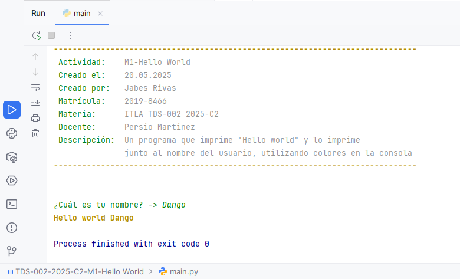
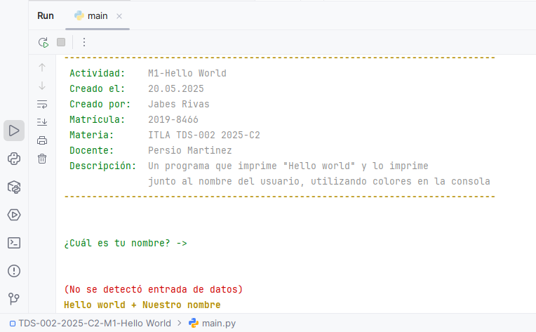

# Actividad: M1-Hello World

- **Creado por:** Jabes Rivas
- **Matrícula:** 2019-8466
- **Materia:** ITLA TDS-002 2025-C2
- **Docente:** Persio Martinez

## Descripción

Este proyecto es un programa simple de Python que demuestra un uso básico de la consola. El script:

1. Muestra una cabecera con información sobre la actividad.
2. Solicita al usuario que ingrese su nombre.
4. Imprime "Hello world" utilizando el nombre ingresado, o un saludo genérico si no se proporciona un nombre.

Se utiliza la biblioteca `colorama` para dar estilo y color al texto en la consola.

## Estructura del Código

* **`main.py`:** Contiene la lógica principal del programa.

    * Función `main()`: Orquesta la ejecución del script, incluyendo la inicialización de `colorama`, la impresión de la
      cabecera, la solicitud de entrada del usuario y la impresión del saludo final.

## Resultado de ejecución

