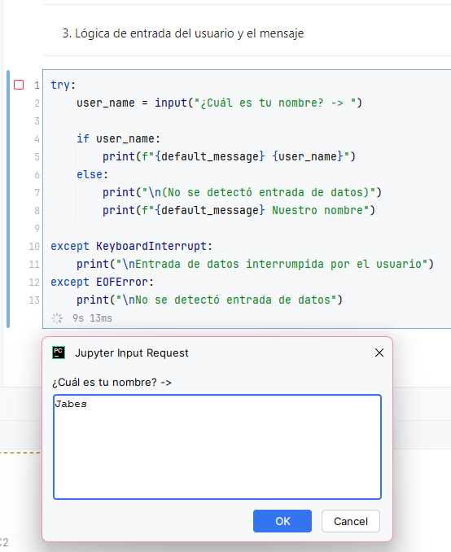
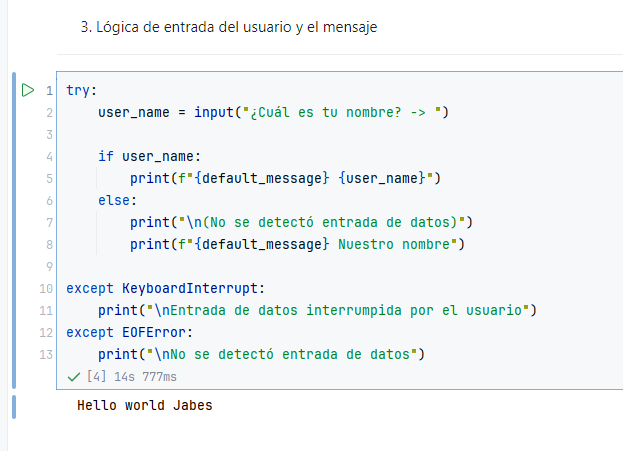

# Actividad: M1-Hello World

- **Creado por:** Jabes Rivas
- **Matrícula:** 2019-8466
- **Materia:** ITLA TDS-002 2025-C2
- **Docente:** Persio Martinez

[Click aquí para abrir en Google Colab](https://colab.research.google.com/github/dangos-dev/TDS-002-2025-C2-M1-Hello_World/blob/master/main.ipynb)

## Descripción

Este proyecto es un programa simple de Python que demuestra un uso básico de la consola. El script:

1. Muestra una cabecera con información sobre la actividad.
2. Solicita al usuario que ingrese su nombre.
4. Imprime "Hello world" utilizando el nombre ingresado, o un saludo genérico si no se proporciona un nombre.

Se utiliza la biblioteca `colorama` para dar estilo y color al texto en la consola.

## Estructura del Código

* **`main.py`:** Contiene la lógica principal del programa.

  * Función `main()`: Orquesta la ejecución del script, incluyendo la inicialización de `colorama`, la impresión de la
    cabecera, la solicitud de entrada del usuario y la impresión del saludo final.

* **`main.ipynb`:** Versión interactiva del programa en formato Jupyter Notebook.
  * Contiene el mismo código que `main.py` pero organizado en celdas separadas para una mejor comprensión y ejecución paso a paso.
  * No incluye colorama por problemas de compatibilidad.

## Resultado de ejecución

